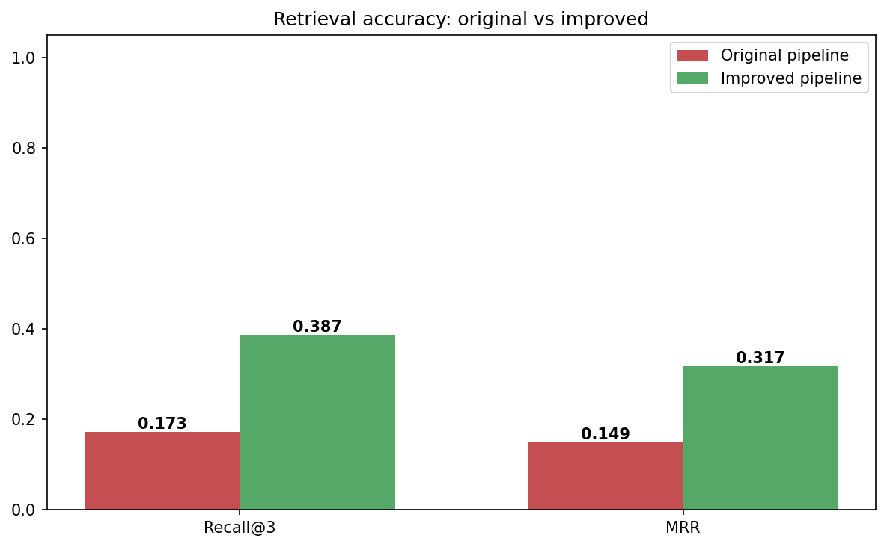
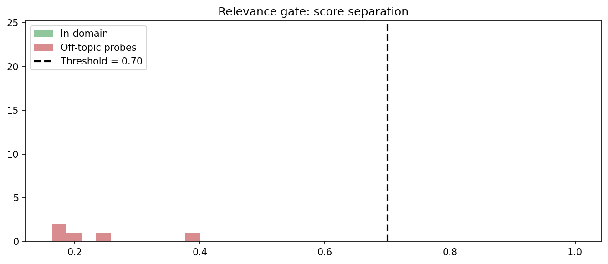
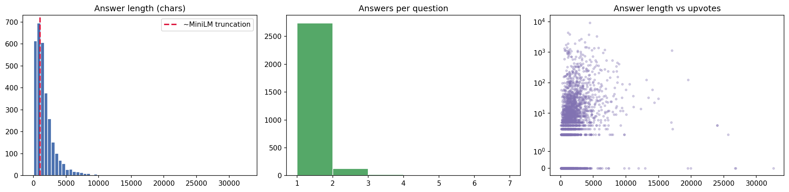
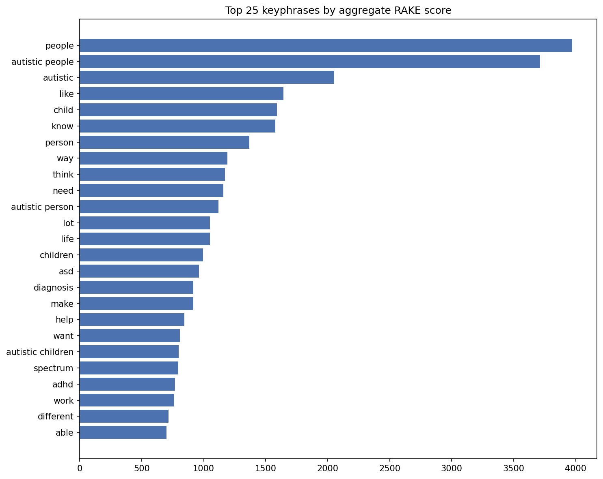
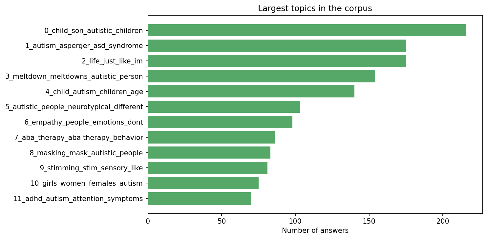

# Autism Q&A Knowledge Retrieval System

[](https://colab.research.google.com/github/shrevid03/autism-qa-retrieval/blob/main/autism_qa_retrieval.ipynb)

A knowledge-driven semantic retrieval system for autism-related queries using
user-generated Quora data. The project builds a structured autism knowledge
base and retrieves relevant answers for a given user query using NLP and
hybrid semantic search.

## Overview

This project extends an autism-related Quora dataset (~3,100 answers) into a
complete retrieval pipeline. It processes real-world Q&A data, extracts
meaningful keyphrases, identifies topics, generates semantic embeddings, and
retrieves the most relevant answers for autism-related user queries — with a
built-in evaluation harness so retrieval accuracy is measured, not assumed.

## Results

Evaluated on 150 held-out questions using the dataset's own
question-to-answer groupings as ground truth:

| Pipeline | Recall@3 | MRR |
|---|---|---|
| Baseline (lemma embeddings + weighted keyword overlap) | 0.173 | 0.149 |
| **Improved (chunked hybrid + RRF + reranking)** | **0.387** | **0.317** |



The improved pipeline more than doubles both metrics. Absolute scores are
conservative: the ground truth only credits answers written for the exact
query question, so relevant answers to near-duplicate questions in the
dataset count as misses for both pipelines.

## Features

* Text preprocessing with noun/adjective filtering and lemmatization
* RAKE-based keyphrase extraction with TF-IDF noise filtering
* Topic modeling with BERTopic (LDA included for comparison)
* Chunked Sentence-BERT embeddings — long answers are split into overlapping
  passages so nothing is lost to the encoder's 256-token limit
* Autism relevance detection with an empirically calibrated threshold
* Hybrid retrieval combining three signals via Reciprocal Rank Fusion:
  * dense embedding similarity (best matching chunk per answer)
  * query-to-question similarity
  * BM25 lexical matching
* Cross-encoder reranking of top candidates for final ordering
* Evaluation using Recall@3 and MRR against a baseline pipeline
* Visualization plots for corpus statistics, keyphrases, topics,
  relevance-gate calibration, and accuracy comparison

## Methodology

```
Raw Dataset
→ Text Cleaning & Deduplication
→ Keyphrase Extraction
→ Topic Modeling (BERTopic)
→ Chunked Sentence-BERT Embeddings + BM25 Index
→ Query Relevance Detection (calibrated gate)
→ Hybrid Retrieval (RRF over dense, question-match, BM25)
→ Cross-Encoder Reranking
→ Evaluation (Recall@3, MRR)
```

## Retrieval Logic

A user query is first checked against the knowledge base's question
embeddings; if its maximum similarity falls below a threshold calibrated from
in-domain vs. off-topic query distributions, it is rejected as not
autism-related.



For relevant queries, three rankings — best-chunk embedding similarity,
query-to-question similarity, and BM25 — are merged with Reciprocal Rank
Fusion, and the top 20 candidates are reranked by a cross-encoder
(`ms-marco-MiniLM-L-6-v2`) to produce the final top-k answers.

## Corpus Analysis

The chunking strategy is motivated by the data itself — a majority of answers
exceed the embedding model's truncation limit:



What the community talks about most, and the dominant topics:





## Dataset

Autism-related Quora question-answer threads with fields: question, answer,
upvotes, views, shares, comments, and comment metadata.

The dataset (`dataset/IRE_Autism.csv`) is included in this repository. It
contains publicly posted Quora answers collected for research purposes; if
you are an author of any included content and want it removed, please open
an issue.

## Repository Structure

```
autism_qa_retrieval.ipynb    — full pipeline notebook
dataset/
  IRE_Autism.csv             — Quora Q&A dataset
visualizations/
  corpus_overview.png
  relevance_gate.png
  results_comparison.png
  top_keyphrases.png
  topics.png
requirements.txt
README.md
```

## How to Run

* Open the notebook in Google Colab (or click the badge above).
* Upload `dataset/IRE_Autism.csv` from this repo to `/content/`.
* Run all cells in order.
* Generated outputs include the processed knowledge base, embeddings,
  evaluation metrics, and all visualizations.

## Note

This system is intended for information retrieval and research purposes only.
It does not provide medical diagnosis or clinical advice. Retrieved answers
are personal experiences shared by community members.
